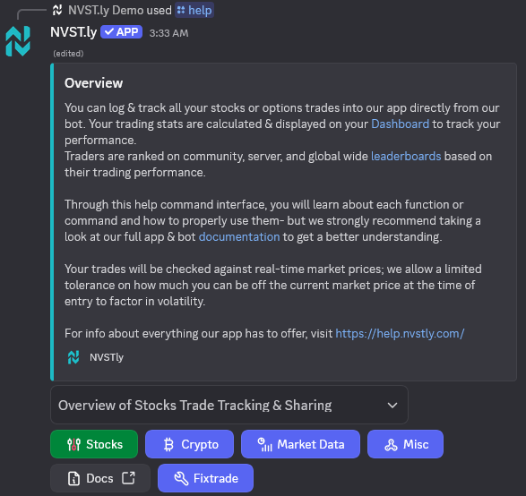
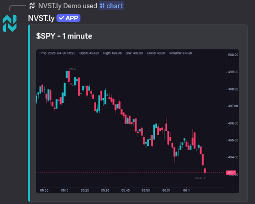

    

# 📈 NVSTly Discord Bot

The **NVSTly Discord Bot** is your all-in-one trading assistant for Discord — a powerful companion to the [NVSTly](https://nvstly.com) social trading platform. Whether you're a trader, investor, or part of a financial Discord community, this bot brings real-time market insights, trade tracking, stats, and charts directly to your server.

[➕ Invite the Bot](https://nvstly.com/go/bot) | [📘 Documentation](https://docs.nvstly.com)

---

## 🚀 What Is NVSTly?

[NVSTly](https://nvstly.com) is a free, multi-platform social trading app that makes it easy to **track, share, and follow trades** across stocks, options, crypto, and more. It includes advanced analytics, real-time feeds, and a unique POV chart that visualizes trader actions directly on candlesticks.

    

---

## 🤖 What Can the Bot Do?

The NVSTly Discord Bot gives you powerful tools without ever leaving Discord:

### 📊 Trading Insights & Stats
- View real-time stats for any trader (win rate, average return, gain/loss, long vs short ratio, and more).
- Get a detailed trading recap for the day/week/month.
- See trader dashboards with high-level performance metrics.

### 🧠 Ticker & Market Data
- Get info, charts, and price data for **stocks** (with support for crypto, forex, and futures coming soon).
- Access options flow, earnings calendars, IPOs, dividends, and more (in development).
- Real-time market sentiment and event tracking.

### 📢 Real-Time Alerts & Streams (Coming Soon)
- Stock halts
- Unusual options activity
- Insider trades
- News & alerts
- Social media sentiment spikes
- Price alerts and custom user notifications

### 📷 Image-Based Outputs
All trading recaps, stats, and charts are generated as sleek, shareable images—great for community sharing.

---

## 🔧 How to Use

1. **Invite the Bot**  
   ➡ https://discord.com/discovery/applications/643262217428533250

2. **Use Slash Commands**  
   Start typing `/` in your Discord server to see available commands.

3. **Link Your NVSTly Account** *(Optional but Recommended)*  
   Link your Discord account to the NVSTly web/mobile app to unlock personal stats and recaps based on your trading activity.

---

## 📷 Previews

    

    

    

    

---

## 📱 Use NVSTly on the Go

For the full trading experience including automated trade tracking via brokerage integrations, download the NVSTly app:

- 🌐 [Web App](https://nvstly.com)
- 📱 [iOS App](https://nvstly.com/go/ios)
- 📱 [Android App](https://nvstly.com/go/android)

---

## 📚 Documentation

For a full list of bot commands, features, and integration info:  
➡ [docs.nvstly.com](https://docs.nvstly.com)

---

## 🧠 Coming Soon

- Crypto, Forex, Futures support. (Trade tracking & sharing already support crypto & forex- futures soon.)
- Full sentiment analytics (X, Reddit, Google)
- AI/ML-powered trade tips and assistants
- 1-Click Copy Trading
- Telegram Bot Integration

---

## 🆘 Help & Support

Support is available through the official [NVSTly Discord server](https://nvstly.com/go/discord), as well via email to [support@nvst.ly](mailto:support@nvst.ly)

---

## 💡 About Trade Hub, LLC

This bot is developed and maintained by [Trade Hub, LLC](https://tradehub.llc), creators of the NVSTly platform.

**Socials:**  
[Discord](https://nvstly.com/discord) | [X/Twitter](https://nvstly.com/go/x) | [YouTube](https://nvstly.com/go/youtube) | [TikTok](https://nvstly.com/go/tiktok) | [Instagram](https://nvstly.com/go/instagram) | [Threads](https://nvstly.com/go/threads) | [Facebook](https://nvstly.com/go/facebook) | [LinkedIn](https://nvstly.com/go/linkedin) | [GitHub](https://nvstly.com/go/github) | [Product Hunt](https://nvstly.com/go/producthunt) | [Mastodon](https://nvstly.com/go/mastodon) | [Nostr](https://nvstly.com/go/nostr) | [Bluesky](https://nvstly.com/go/bsky) | [Hive/InLeo](https://nvstly.com/go/hive) | [Medium](https://nvstly.com/go/medium) | [Substack](https://nvstly.com/go/substack)

                 

---

_Join over 50,000+ traders already using NVSTly to trade smarter._  

